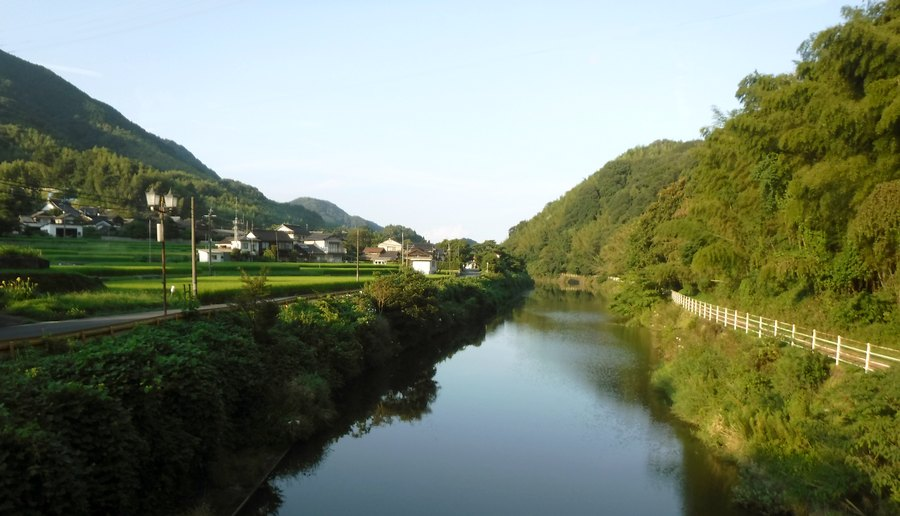

# Home Page for Iwakuni Bob
---
My name is Bob and I live at Yuu-cho Iwakuni-shi, Yamaguchi-ken, JAPAN.  
僕の名前をぼぶです。
日本国山口県岩国市由宇町にすんでいます。

It is a Japan countryside place and I my apartment is surrounded by rice paddies. 

There is something reassuring about being surrounded by food in these troubled times.

I hope to teach a seminar at [Plat-ABC](https://plat-abc.jp/) about how to make a web site using Markdown and host on GitHub.
The current instructions document for the seminar is [here](websiteMarkdown.pdf).
Feel free to examine [my resume](https://islandman.org/resume/index.html) or [printable resume](Resume-RobertLaurie-digitalmedia.pdf).

Here is a link to my [photo album](https://iwakunibob.github.io/photos/) 
